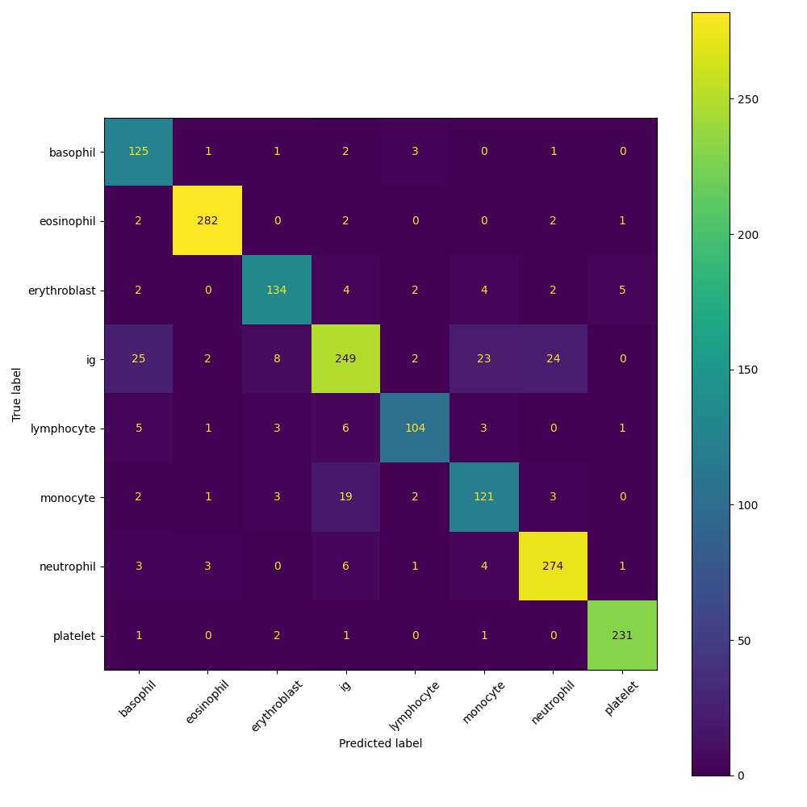

# Blood Cell Classifier

A deep learning pipeline that classifies blood cell microscopy images into 8 categories using transfer learning with ResNet18.

Built as a demonstration of applied ML on biological imaging data.

## Results

| Epoch | Train Loss | Train Acc | Val Loss | Val Acc |
|-------|-----------|-----------|----------|---------|
| 1 | 0.805 | 76.6% | 0.500 | 85.3% |
| 2 | 0.423 | 87.3% | 0.364 | 89.1% |
| 3 | 0.358 | 88.6% | 0.331 | 89.6% |
| 4 | 0.323 | 89.6% | 0.329 | 89.5% |
| 5 | 0.307 | 90.1% | 0.305 | 90.4% |

**Test Accuracy: 88.9%** on completely unseen images.

## Live Demo

Try it here: [Hugging Face Space](https://huggingface.co/spaces/AdamA67/blood-cell-classifier)

## Why Transfer Learning?

Biological imaging datasets are small in nature due to the cost and time required to collect and label microscopy images. Training a deep CNN from scratch on such a small dataset will result in overfitting.

To avoid this problem, pre-trained models based on the ResNet18 architecture pretrained on the ImageNet dataset of 1 million images are used. The early layers of the network contain general knowledge of the visual world that can be transferred to recognizing blood cell types. Only the final classification layer is trained on the 8 classes of blood cells, resulting in good classification performance with minimal training data.

## Classes
- Basophil
- Eosinophil
- Erythroblast
- IG (Immature Granulocyte)
- Lymphocyte
- Monocyte
- Neutrophil
- Platelet

## Confusion Matrix

**Key finding:** IG (Immature Granulocyte) was the hardest class to classify, with mistakes spread across basophil, monocyte and neutrophil. This is biologically expected as immature granulocytes visually resemble several mature cell types during development.

## Tech Stack
- **PyTorch** — model training and inference
- **torchvision** — ResNet18, transforms, data loading
- **Gradio** — interactive web deployment
- **MLflow** — experiment tracking
- **scikit-learn** — confusion matrix evaluation

## Project Structure
├── model.py        
├── train.py        
├── app.py      
├── outputs/
│   ├── model.pth           
│   └── confusion_matrix.png
└── requirements.txt

Dataset: [Blood Cells Image Dataset](https://www.kaggle.com/datasets/unclesamulus/blood-cells-image-dataset) via Kaggle
